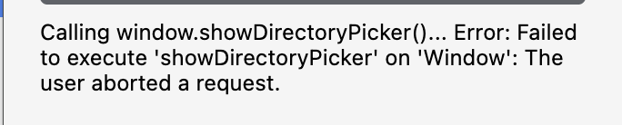

# Chrome Extension File System Access API Bug Reproducer

Minimal Chrome Manifest V3 extension to reproduce crashes and errors when calling `window.showDirectoryPicker()` from extension contexts on macOS.

## Issues

When calling the File System Access API's `window.showDirectoryPicker()` from a Chrome extension on macOS, different issues occur depending on the context and folder selected:

### Popup Context

**Issue 1: System folders (e.g., `/Users/<user>/Documents`)**
- Shows error: "can't open this folder because it contains system files"
- Even though this is a user-accessible folder

**Issue 2: User-created subfolders (e.g., `/Users/<user>/Documents/test`)**
- Returns error: "Failed to execute 'showDirectoryPicker' on 'Window': The user aborted a request"
- This occurs even though the user clicked OK in the macOS directory picker dialog
- The user explicitly granted access, but the API reports it as "aborted"

### Side Panel Context

**Issue 3: Any folder selection**
- Chrome crashes immediately
- Occurs regardless of which folder is selected

## Environment

- **OS**: macOS 15.5 (24F74)
- **Chrome**: Version 141.0.7390.55 (Official Build) (arm64)
- **Extension**: Manifest V3

## Reproduction Steps

### Test Issue 1 & 2 (Popup - System Files & User Aborted Errors)

1. Clone this repository
2. Open Chrome and navigate to `chrome://extensions/`
3. Enable "Developer mode" (toggle in top right)
4. Click "Load unpacked" and select this directory
5. Click the extension icon in the toolbar to open the **popup**
6. Click the "Call window.showDirectoryPicker()" button
7. In the directory picker dialog:
   - **For Issue 1**: Select `/Users/<your-username>/Documents` → Error: "can't open this folder because it contains system files"
   - **For Issue 2**: Create a test folder like `/Users/<your-username>/Documents/test` and select it → Error: "The user aborted a request" (even though you clicked OK)

### Test Issue 3 (Side Panel - Crash)

1. Follow steps 1-4 above
2. In the popup, click "Open Side Panel Test" button
3. Click the "Call window.showDirectoryPicker()" button in the side panel
4. Select any folder
5. **Chrome crashes immediately on macOS**

## Expected Behavior

The native directory picker dialog should appear, allow the user to select any directory they have access to, and return a `FileSystemDirectoryHandle` for the selected directory.

## Actual Behavior

- **Popup + system folders**: False "system files" error for user-accessible directories
- **Popup + user subfolders**: False "user aborted" error despite user granting access
- **Side panel + any folder**: Chrome crashes

## Files

- `manifest.json` - Minimal MV3 manifest with sidePanel permission and popup
- `background.js` - Service worker that opens side panel on icon click
- `popup.html` - Popup UI with crash trigger button
- `popup.js` - Calls `window.showDirectoryPicker()` from popup, can also open side panel
- `sidepanel.html` - Side panel UI with crash trigger button
- `sidepanel.js` - Calls `window.showDirectoryPicker()` from side panel
- `screenshot-system-files-error.png` - Screenshot of Issue 1
- `screenshot-user-aborted-error.png` - Screenshot of Issue 2

## Notes

This is the simplest possible reproduction case. The issues occur regardless of:
- Whether the call is in a try-catch block
- User interaction (button click triggers the call)
- Other extension permissions or features

The File System Access API works correctly in regular web pages, but has multiple issues when called from Chrome extension contexts (popup, side panel) on macOS.
